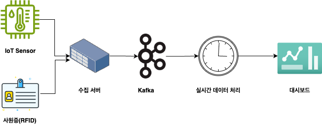
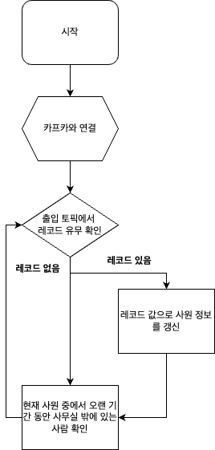
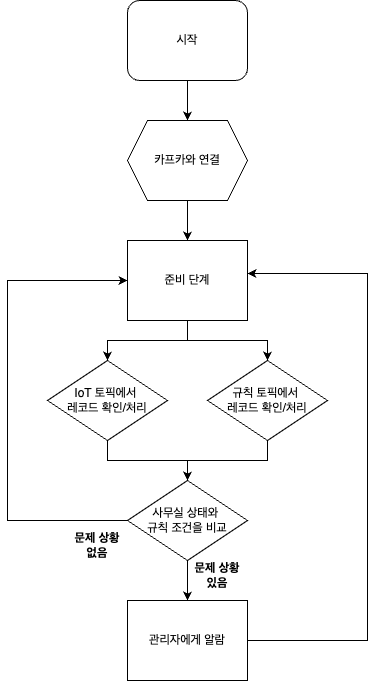

# 실시간 데이터 처리 프로젝트

## 1. 목적
* 해당 프로젝트는 실시간 데이터 처리 작업 코드 연습을 위한 것입니다. 
* 해당 프로젝트는 이하의 상황을 가정하고 있습니다.
  * 회사에서 흡연자, 비흡연자의 업무 시간 갈등이 심해서, 실제 흡연자들의 근무 시간이 아닌 사람에 비교해서 차이가 큰 지를 확인하고, 너무 그 차이가 심한 경우에는 경고를 주려고 하고 있습니다. 
  * 현재 사무실에 보관 중인 장비들은 사무실 온도, 습도가 일정 이상 높아지면 나쁜 영향을 받습니다. 이를 방지하려고 하고 있습니다. 

## 2. 도식도



* IoT Sensor: 사무실 방의 온도를 측정
* 사원증(RFID): 사원들은 사무실을 나갈 때마다, 해당 카드로 출입 
* 수집 서버: 위의 두 정보를 수집하여 Kafka에 전송 
* Kafka: 카프카 클러스터
* 실시간 데이터 처리: Consumer로 Kafka에서 데이터를 받아 처리
* 대시보드: 실시간 데이터 처리 결과의 시각화


## 3. 로직


### 1. 직원 관리 로직



### 2. 사무실 상태 관리 로직



## 4. 코드

### 1. 수집 서버 코드

* 사무실 직원 정보 수집
```
blank
```

* 사무실 환경 센서
```
blank
```

* 사무실 환경 규칙
```
blank
```


### 2. 실시간 처리 

#### 1. 사원 처리 코드
* ./entrance_realtime_processor.py
```
def realtime_entrance_processor():
    entrance_consumer = KafkaConsumer(
        "entrance",
        auto_offset_reset="latest",
        group_id="entrance_realtime",
        client_id="app1",
        bootstrap_servers=["localhost:9092"],
        key_deserializer=lambda k: k.decode("utf-8"),
        value_deserializer=lambda m: json.loads(m.decode("utf-8")),
    )
    one_minute = 5
    next_check = time.time() + one_minute
    realTimeProcess = EntranceRealTimeProcess()

    while True:
        records = entrance_consumer.poll(2)
        for partition_info, messages in records.items():
            print(partition_info)
            for message in messages:
                print(message.value)
                try:
                    value = message.value

                    entranceRecord = EntranceRecord(
                        name=message.key,
                        record_type=value["record_type"],
                        record_time=value["value"],
                    )
                    realTimeProcess.process_record(entranceRecord)
                except Exception as e:
                    print(e)

        if next_check < time.time():
            realTimeProcess.check_present_time()
            next_check = time.time() + one_minute
```


#### 2. 사무실 상태 관리 로직


## 5. 실습 환경 설정


### 1. 카프카 설치

```
wget https://dlcdn.apache.org/kafka/3.7.0/kafka_2.13-3.7.0.tgz
tar -xzf kafka_2.13-3.7.0.tgz
mv kafka_2.13-3.7.0 kafka
```


### 2. 카프카 실행하기

```
cd kafka
$ KAFKA_CLUSTER_ID="$(bin/kafka-storage.sh random-uuid)"
$ bin/kafka-storage.sh format -t $KAFKA_CLUSTER_ID -c config/kraft/server.properties
$ bin/kafka-server-start.sh config/kraft/server.properties
```

* 로컬에서 실행하는 경우로, 이 방식은 그대로 실제 환경에서 사용하면 안됩니다. 
* 해당 방식은 zookeeper을 사용하지 않는 방식입니다. 

### 3. 카프카 토픽 만들기

```
# room 토픽 만들기
$ bin/kafka-topics.sh --create --topic room --partitions 2 --bootstrap-server localhost:9092

# entrance 토픽 만들기
$ bin/kafka-topics.sh --create --topic entrance --partitions 2 --bootstrap-server localhost:9092
```

* 위의 토픽 만들기는 로컬에서의 설정으로, 실제 상황에서는 replication과 partition의 수를 고려해야 합니다. 


## 5. 실습해보기


### 1. 사용자 출입 데이터 넣기

```
curl -X POST -H "Content-Type: application/json" -d '{"name": "jane", "value": "in"}' http://127.0.0.1:5000/
```

```
curl -X POST -H "Content-Type: application/json" -d '{"name": "jane", "value": "in"}' http://127.0.0.1:5000/entrance
curl -X POST -H "Content-Type: application/json" -d '{"name": "jane", "value": "out"}' http://127.0.0.1:5000/entrance
```
### 2. 방 온도 데이터 넣기

```
curl -X POST -H "Content-Type: application/json" -d '{"room_no": 1, "status": {"humidity":10,"temperature":30}}' http://127.0.0.1:5000/office_status

curl -X POST -H "Content-Type: application/json" -d '{"room_no": 2, "status":{"humidity":10,"temperature":30} }' http://127.0.0.1:5000/office_status
```

### 3. 온도 규칙 데이터 넣기
```
curl -X POST -H "Content-Type: application/json" -d '{"room_no": 1,  "value": {"schedule_id": 1,"order":"insert","condition":{"temperature":{"agg_type":"min","up":20,"down":null},"humidity":{"agg_type":"mean","up":20,"down":null}}}}' http://127.0.0.1:5000/office_rule

curl -X POST -H "Content-Type: application/json" -d '{"room_no": 1,  "value": {"schedule_id": 1,"order":"update","condition":{"temperature":{"agg_type":"mean","up":20,"down":null},"humidity":{"agg_type":"mean","up":20,"down":null}}}}'  http://127.0.0.1:5000/office_rule

curl -X POST -H "Content-Type: application/json" -d '{"room_no": 1,  "value": {"schedule_id": 1,"order":"delete","condition":{}}}'  http://127.0.0.1:5000/office_rule

```

## 6. 작업 중인 내용